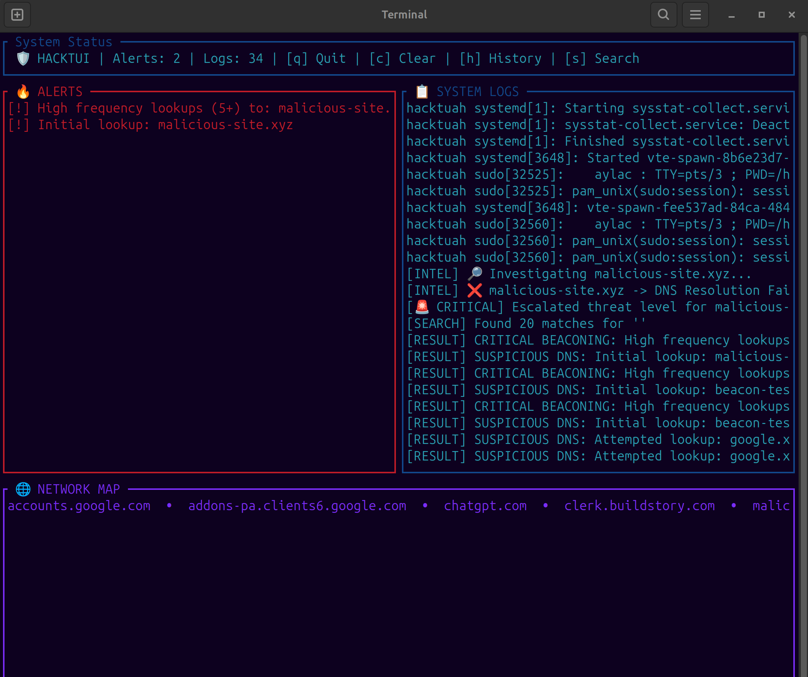

# HackTUI 

    ██╗  ██╗ █████╗  ██████╗██╗  ██╗ ████████╗██╗   ██╗██╗
    ██║  ██║██╔══██╗██╔════╝██║ ██╔╝ ╚══██╔══╝██║   ██║██║
    ███████║███████║██║     █████╔╝     ██║   ██║   ██║██║
    ██╔══██║██╔══██║██║     ██╔═██╗     ██║   ██║   ██║██║
    ██║  ██║██║  ██║╚██████╗██║  ██╗    ██║   ╚██████╔╝██║
    ╚═╝  ╚═╝╚═╝  ╚═╝ ╚═════╝╚═╝  ╚═╝    ╚═╝    ╚═════╝ ╚═╝

------------------------------------------------------------------------

##  Project Overview

HackTUI is a unified **SIEM (Security Information & Event Management)** and 
**NDR (Network Detection & Response)** platform built on the Elixir/OTP runtime. 
By combining real-time packet inspection (NDR) with persistent forensic 
storage and correlation (SIEM), it transforms raw system telemetry into 
actionable security intelligence.

------------------------------------------------------------------------

##  Dashboard Preview



*Figure 1: Real-time correlation of DNS beaconing events and GeoIP
enrichment.*

------------------------------------------------------------------------

##  Advanced SIEM Features

* **Stateful Correlation Engine**
    Tracks behavioral patterns over time. It automatically escalates repetitive suspicious lookups from standard warnings to **CRITICAL** alerts to highlight potential malware beaconing.

* **Asynchronous Threat Enrichment**
    Leverages a dedicated enrichment worker to perform non-blocking DNS resolution and GeoIP lookups (Country, ISP) for flagged domains without interrupting packet ingestion.

* **Persistent Historical Storage**
    Integrated with **PostgreSQL** via Ecto. All security events are serialized to a permanent data store, allowing for deep forensic analysis and historical trend reporting.

* **Fault-Tolerant Design**
    Built on the Erlang/OTP supervision tree. Individual components are isolated; a failure in one component does not compromise the stability of the entire SOC.

* **Historical Forensic Search**
    Interactive search mode (press **[s]**) allows investigators to query the PostgreSQL backend for specific domains or alert patterns. This instantly retrieves historical telemetry from the database for deep incident correlation.

------------------------------------------------------------------------

##  Architecture

The system operates as a supervised tree of specialized concurrent
processes:

-   **NetScout** -- Ingestion layer managing raw packet capture via
    `tcpdump`.
-   **Enricher** -- Intelligence layer providing GeoIP and Threat Intel
    metadata.
-   **Repo** -- Persistence layer managing the PostgreSQL interface.
-   **State** -- Correlation engine and single source of truth.
-   **Dashboard** -- Terminal rendering engine built on `ExRatatui`.

------------------------------------------------------------------------

##  Installation & Setup

### 1️⃣ System Dependencies

Monitoring agents require specific Linux capabilities:

``` bash
# Grant network sniffing permissions
sudo setcap 'cap_net_raw,cap_net_admin=eip' $(which tcpdump)
```

``` bash
# Grant journal access
sudo usermod -a -G systemd-journal $USER
```

Log out and back in after modifying group permissions.

------------------------------------------------------------------------

### 2️⃣ Environment Configuration

Create a `.env` file in the project root:

``` bash
# .env
export HACKTUI_DB_PASS="your_secure_30_character_password"
```

------------------------------------------------------------------------

### 3️⃣ Database Initialization

``` bash
source .env
mix deps.get
mix ecto.setup
```

------------------------------------------------------------------------

## ▶ Usage

``` bash
source .env
mix run --no-halt
```

------------------------------------------------------------------------

## 🎛️ Controls

  Key   Action
  ----- ---------------------------------------
  q     Graceful Shutdown
  c     Clear In-Memory Alerts
  h     Fetch Historical Alerts from Database
  s     Search 

------------------------------------------------------------------------

##  Tech Stack

-   **Language:** Elixir 1.19+ (OTP 28)
-   **Database:** PostgreSQL 16+ (Ecto)
-   **Networking:** Req (HTTP), Port-based TCPDump
-   **TUI:** ExRatatui 0.4.1

------------------------------------------------------------------------

##  License

MIT License

Copyright (c) 2026 aylac

Permission is hereby granted, free of charge, to any person obtaining a copy
of this software and associated documentation files (the "Software"), to deal
in the Software without restriction, including without limitation the rights
to use, copy, modify, merge, publish, distribute, sublicense, and/or sell
copies of the Software, and to permit persons to whom the Software is
furnished to do so, subject to the following conditions:

The above copyright notice and this permission notice shall be included in all
copies or substantial portions of the Software.

THE SOFTWARE IS PROVIDED "AS IS", WITHOUT WARRANTY OF ANY KIND, EXPRESS OR
IMPLIED, INCLUDING BUT NOT LIMITED TO THE WARRANTIES OF MERCHANTABILITY,
FITNESS FOR A PARTICULAR PURPOSE AND NONINFRINGEMENT. IN NO EVENT SHALL THE
AUTHORS OR COPYRIGHT HOLDERS BE LIABLE FOR ANY CLAIM, DAMAGES OR OTHER
LIABILITY, WHETHER IN AN ACTION OF CONTRACT, TORT OR OTHERWISE, ARISING FROM,
OUT OF OR IN CONNECTION WITH THE SOFTWARE OR THE USE OR OTHER DEALINGS IN THE
SOFTWARE.
